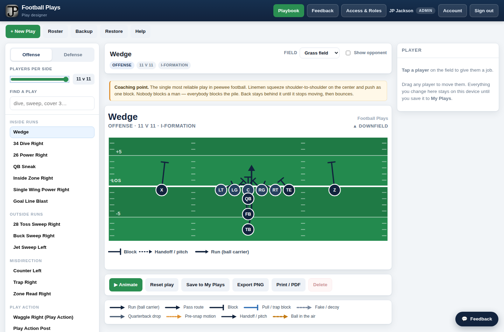

# Football Plays

A football play designer for youth coaches, with accounts, a shared team playbook,
and a feedback channel back to JP. Runs as a Cloudflare Worker with a D1 database.

Built for Josh Bujnoch's peewee team.



## Deploying it

Everything below is a one-time setup. After that, `npm run deploy` is the whole loop.

The `football-plays` D1 database already exists and its tables are built, and its id
is already in `wrangler.jsonc`. Two commands stand between the repo and a live site:

```bash
npm install

# The one secret it can't run without: signs the login cookies.
# Any long random string; this generates one and pipes it straight in.
node -e "console.log(crypto.randomUUID()+crypto.randomUUID())" | npx wrangler secret put SESSION_SECRET

npm run deploy
```

If wrangler asks you to sign in, `npx wrangler login` opens a browser — no API token
needed. It's stored per machine, so a machine that has deployed any Worker before is
already authenticated.

Optional, any time later — turns feedback email on. Without it, feedback still saves
and still shows up in the admin screen:

```bash
npx wrangler secret put RESEND_API_KEY
```

Then open **https://footballplays.jpsapps.com** and you'll land on a one-time setup page
to create your admin account. That page turns itself off the moment the account exists,
so it can't be used to add a second admin.

Local development: `npm run db:local` once, then `npm run dev`.
Local runs read secrets from `.dev.vars` (gitignored).

### Feedback email

Feedback saves and appears in the admin screen whether or not email is configured.
Out of the box it sends from `onboarding@resend.dev`, which needs no DNS but only
delivers to the address your Resend account is registered under — fine, since feedback
only goes to you.

To send from your own domain instead, add these records to the `jpsapps.com` zone in
Cloudflare, hit **Verify** on the domain in Resend, then switch `FEEDBACK_FROM` in
`wrangler.jsonc` to `feedback@notify.jpsapps.com`:

| Type | Name | Value | Priority |
| --- | --- | --- | --- |
| TXT | `resend._domainkey.notify` | `p=MIGfMA0GCSqGSIb3DQEBAQUAA4GNADCBiQKBgQCySbPJmBetxpUk2ZF1ADeloi9iCLuIuQVxWyMWS9OHl3fhy0cuJzzxWYZmeverNnlHcppZPSnFISNJakE7PlD0iYeKvStrhZzeFQBfmGJ5j8ujX1EVhvQMpNrjtI0gzLGKLz2jnwkUJBZWxnP0HIz6sAjVAv548bvSyR+n3AW3qwIDAQAB` | |
| MX | `send.notify` | `feedback-smtp.us-east-1.amazonses.com` | 10 |
| TXT | `send.notify` | `v=spf1 include:amazonses.com ~all` | |

Turn **off** Cloudflare's orange-cloud proxy for these — they're mail records, not web traffic.

## Accounts and roles

There is no self-signup. You create every account under **Access & Roles**.

| Role | Can do |
| --- | --- |
| **Coach** | Open the playbook, draw and save plays, edit the roster, send feedback |
| **Admin** | All of the above, plus Access & Roles and Feedback triage |

- **Teams.** Everyone on the same team name shares one playbook and one roster. Put Josh
  and his assistants on the same team and they all see the same plays.
- **Passwords** are hashed with PBKDF2-SHA256 (210,000 iterations, per-user salt). They're
  never stored, logged or emailed in the clear. A password you set for someone is shown to
  you once, on screen, and never again — the app can only reset it, never reveal it.
- New accounts are asked to pick their own password the first time they sign in.
- The app won't let you remove your own admin access, switch off your own account, or
  delete the last active admin — those are the mistakes that lock everyone out.
- Turning an account off takes effect immediately, even on a browser that's already signed in.

## Feedback

Every page has a **Feedback** button. It captures the category, the message, who sent it
and which page they were on — identity always comes from the signed-in session, never
from the page, so feedback is always attributable.

You triage it at **/admin/feedback**: a status pipeline (New → Investigating → In Progress →
Resolved / Not Planned), free-text notes, and one chronological timeline mixing status
changes and notes together. Email notification is best-effort — a failed send never blocks
the submission, and the outcome is recorded on the row so a silent email problem is visible
rather than invisible.

## What the app does

- **34 plays built in** — 23 offense, 11 defense, with the coaching point for each.
- **Any team size, 5 v 5 through 11 v 11.** Move the slider and every formation rebuilds.
  Plays needing more bodies than you have are hidden.
- **Draw your own.** Name it, pick a formation, drag players, then give each one a job —
  run, route, block, pull, fake, motion, blitz, man coverage, zone drop.
- **Animate** walks every player down their assignment so the kids can see it develop.
- **Real names.** Enter the roster once, then assign kids to spots.
- **Export a PNG** to text the parents, or print a playbook sheet.
- **Backup / Restore** the whole playbook as a JSON file.

### The library

**Offense** — Wedge · 34 Dive · 26 Power · 28 Toss Sweep · Counter · QB Sneak · Buck Sweep ·
Trap · Waggle · Jet Sweep · Inside Zone · Zone Read · Single Wing Power · Goal Line Blast ·
All Slants · Four Verticals · Curl/Flat · Smash · Stick · Bubble Screen · RB Screen ·
Sprint Out · Play Action Post

**Defense** — 5-3 Cover 3 · 5-3 Run Fits · 6-2 Gap Control · 4-4 Cover 3 · 4-4 Double A Blitz ·
4-3 Cover 2 · 4-3 Cover 1 Man · 3-4 Cover 3 · 5-2 Monster · Corner Blitz Cover 0 · Goal Line 6-5

### Reading a diagram

| Symbol | Means |
| --- | --- |
| Circle | Offensive player |
| Square | Defensive player |
| Line ending in an arrow | That player moves there |
| Line ending in a cross bar | A block |
| Blue line | A pulling or trapping lineman |
| Dashed line | A fake, pre-snap motion, or the ball in the air |
| Dashed line ending in a circle | A zone drop — the defender settles in that area |

Downfield is up. The thick line across the middle is the line of scrimmage.

## How it's put together

| Path | What it is |
| --- | --- |
| `src/worker.js` | Entry point. Every request hits it first, which is what lets the login gate run before any page is served. |
| `src/shared.js` | Responses, escaping, password hashing, session cookies, audit trail |
| `src/auth.js` | Sign in/out, first-run setup, changing your own password |
| `src/users.js` | Access & Roles — accounts, roles, teams, password resets |
| `src/plays.js` | The team playbook and roster |
| `src/feedback.js` | Feedback submit, triage, and the notification email |
| `public/index.html` | The play designer — the whole editor in one file |
| `public/shell.css`, `public/shell.js` | Shared header, feedback widget, API helper |
| `public/admin-*.html` | The two admin screens |
| `schema.sql` | D1 tables. Safe to re-run. |

Only `public/` is served as static assets, so Worker source and `schema.sql` can't be
fetched over HTTP.

Plays are authored in yards relative to the ball and compiled to SVG at load time, which
is why one play can be drawn for any number of players. PNG export serializes the live
SVG, so the image is pixel-identical to the screen.
